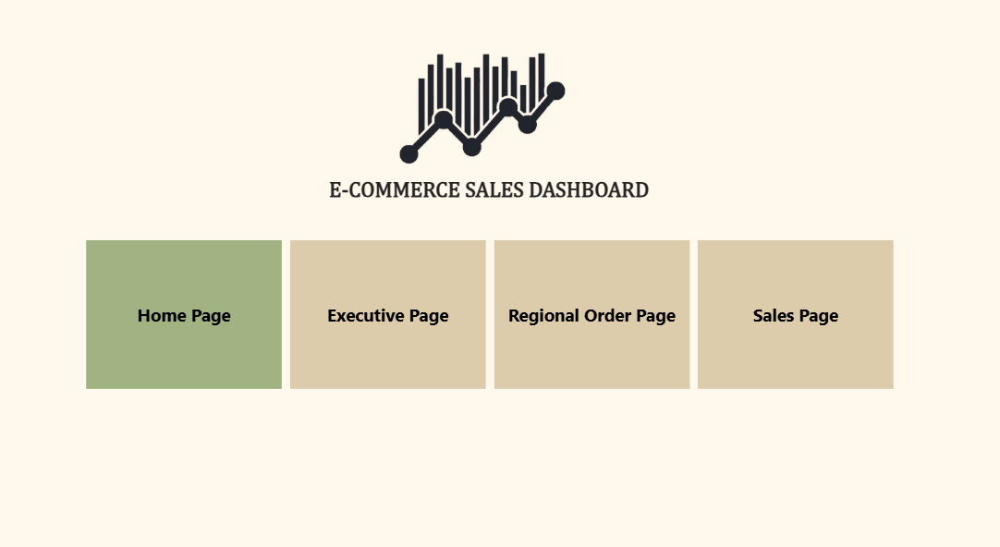
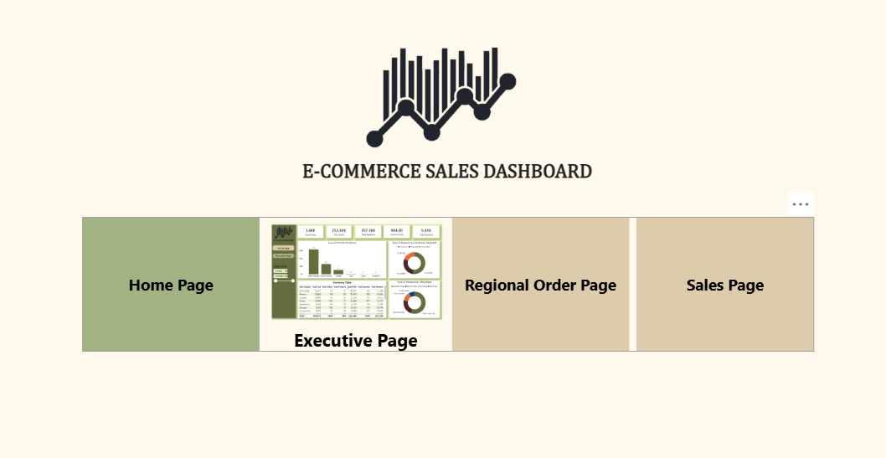
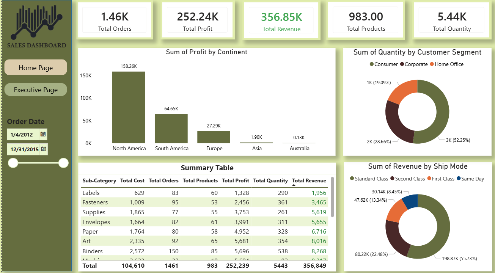
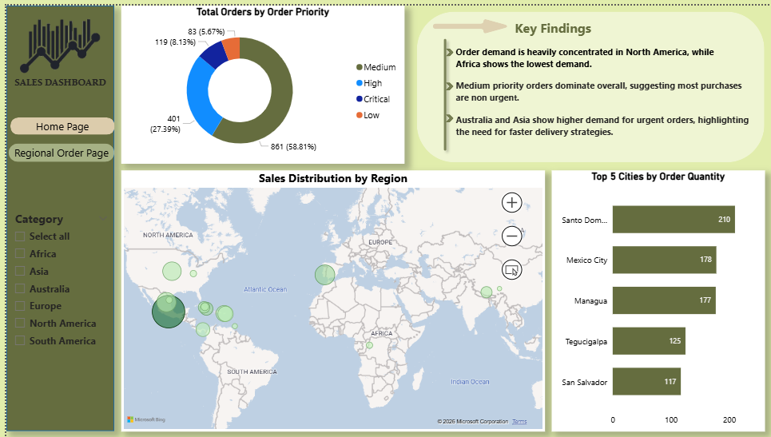
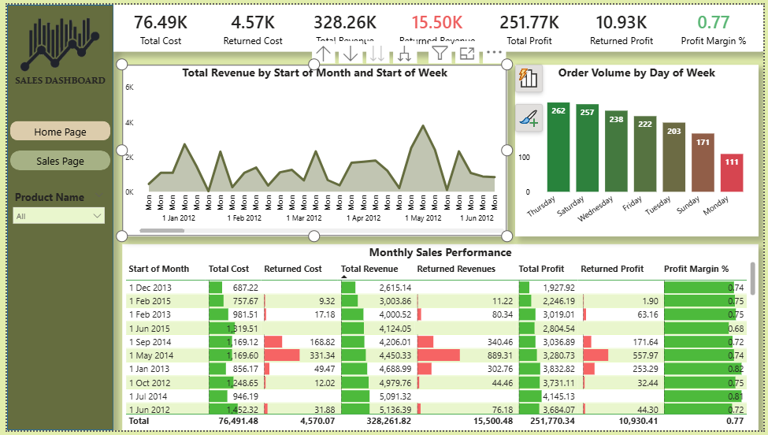

# 📊 E-commerce Sales Analysis Dashboard (Power BI)

## 📌 Project Overview

This project presents an interactive **E-commerce Sales Analysis Dashboard** built using **Power BI**. The dashboard provides comprehensive insights into sales performance, customer behavior, regional distribution, and product-level trends.

The objective of this project is to transform raw sales data into meaningful business insights to support data-driven decision-making.

---

## 🗂️ Dataset Used

* `sales.csv` – Contains transactional sales data including orders, products, customers, and financial metrics
* `return_table.csv` – Contains returned order information

---

## 🏗️ Data Modeling

### ⭐ Star Schema

* Fact Table: **Sales**
* Dimension Tables:

  * Date
  * Region
  * Return

### ❄️ Snowflake Schema

* Product
* Product Sub-Category
* Product Category

This hybrid modeling approach improves data organization and query performance.

---

## 🧮 Calculations (DAX)

Key calculated columns and measures:

* **Cost** = Product Cost + Shipping Cost
* **Revenue** = Sales value before discount
* **Profit** = Revenue – Cost
* **Profit Margin %**
* **Returned Revenue, Cost, Profit** (using Return table)

---

## 📊 Dashboard Pages

### 🏠 1. Homepage

* Navigation hub for all report pages
* Interactive buttons for seamless page navigation

---

### 📈 2. Executive Dashboard

* KPIs:

  * Total Orders
  * Total Quantity
  * Total Revenue
  * Total Profit
* Visuals:

  * Profit by Continent
  * Shipping Mode Distribution
  * Customer Segment Analysis
  * Product Sub-category Summary
* Date slicer for dynamic filtering

---

### 🌍 3. Regional Order Analysis

* Order Priority Distribution
* Interactive Map (Country → State → City drill-down)
* Top 5 Cities by Order Quantity
* Continent slicer for regional filtering

---

### 💰 4. Sales Analysis

* KPIs:

  * Total Cost, Revenue, Profit
  * Returned Metrics
  * Profit Margin %
* Time-series Area Chart (Drill-down: Month → Week → Date)
* Monthly summary table with data bars
* Product-level slicer for detailed analysis

---

## 🔍 Key Insights

* **North America** is the primary revenue and profit contributor
* **Consumer segment** dominates total orders
* **Standard shipping** is the most preferred delivery method
* High-performing product categories include **Furniture and Technology**
* Returns impact profitability but remain relatively low
* Sales trends fluctuate over time, indicating seasonal demand patterns

---

## 🎯 Features

* Interactive slicers (Date, Continent, Product)
* Drill-down capabilities for detailed analysis
* Bookmark-based reset functionality
* Clean and user-friendly dashboard design

---

## 🛠️ Tools & Technologies

* **Power BI Desktop**
* **DAX (Data Analysis Expressions)**
* Data Modeling (Star & Snowflake Schema)

---

## 📷 Dashboard Preview
### Homepage Dashboard

### Executive page Dashboard

### Regional page Dashboard

### Sales page Dashboard

---

## 🚀 How to Use

1. Download the `.pbix` file
2. Open in Power BI Desktop
3. Interact with slicers and visuals to explore insights

---

## 📌 Conclusion

This dashboard demonstrates how data visualization and modeling techniques can be used to uncover valuable business insights. It highlights performance trends, regional opportunities, and operational improvements for an e-commerce business.
